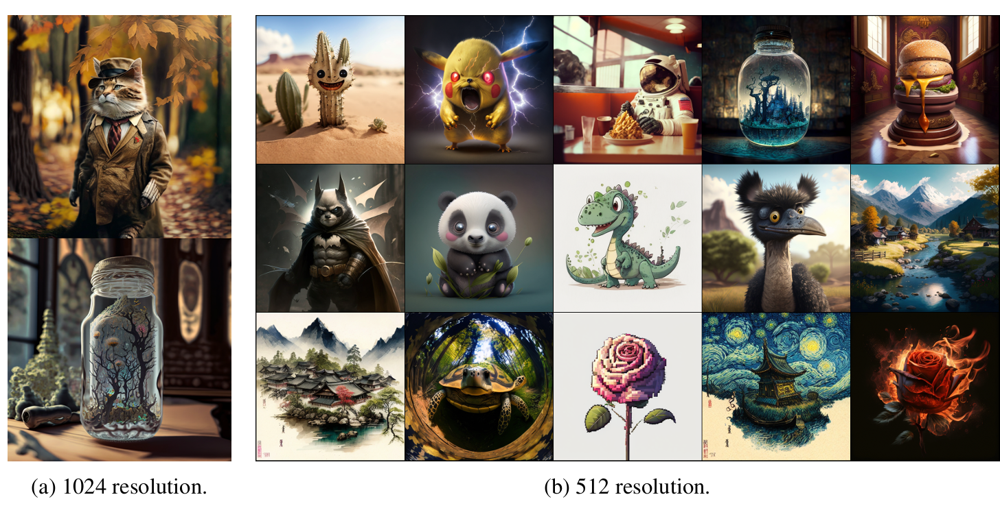

# You Only Sample Once: Taming One-Step Text-To-Image Synthesis by Self-Cooperative Diffusion GANs

This is the Official Repository of  You Only Sample Once: Taming One-Step Text-To-Image Synthesis by Self-Cooperative Diffusion GANs, by *Yihong Luo, Xiaolong Chen, Jing Tang*.

## Pre-trained Models
- [YOSO-PixArt-α-512](https://huggingface.co/Luo-Yihong/yoso_pixart512)
- [YOSO-PixArt-α-1024](https://huggingface.co/Luo-Yihong/yoso_pixart1024)
- [YOSO-sd1.5-lora](https://huggingface.co/Luo-Yihong/yoso_sd1.5_lora)

Note that YOSO-PixArt-α-512 is trained on JourneyDB with 512 resolution. YOSO-PixArt-α-1024 is obtained by directly merging YOSO-PixArt-α-512 with PixArt-XL-2-1024-MS.

## Contact
Please contact Yihong Luo (yluocg@connect.ust.hk) if you have any questions about this paper.

