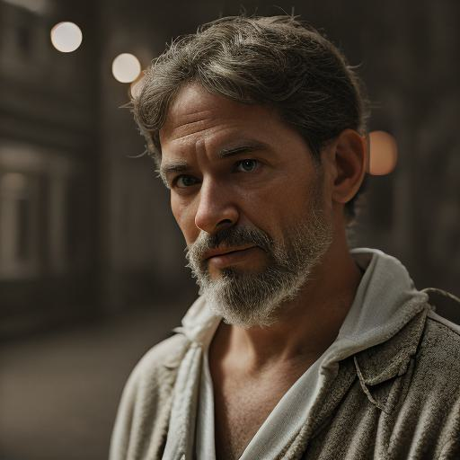
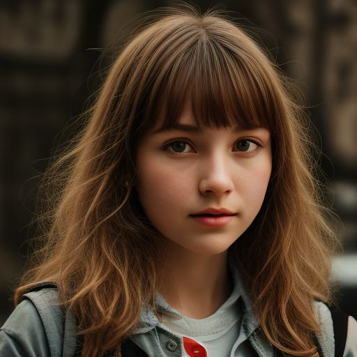

# You Only Sample Once: Taming One-Step Text-To-Image Synthesis by Self-Cooperative Diffusion GANs

<div align="center">
  <a href="https://yoso-t2i.github.io/"></a> &ensp;
  <a href="https://arxiv.org/abs/2403.12931"></a> &ensp;
</div>


This is the Official Repository of  "[You Only Sample Once: Taming One-Step Text-to-Image Synthesis by Self-Cooperative Diffusion GANs](https://www.arxiv.org/abs/2403.12931)", by *Yihong Luo, Xiaolong Chen, Xinghua Qu, Jing Tang*.


## 🔥News 

- (2024/05/28) Training code of YOSO-LoRA is released!!!

## Pre-trained Models

- [YOSO-PixArt-α-512](https://huggingface.co/Luo-Yihong/yoso_pixart512)
- [YOSO-PixArt-α-1024](https://huggingface.co/Luo-Yihong/yoso_pixart1024)
- [YOSO-sd1.5-lora](https://huggingface.co/Luo-Yihong/yoso_sd1.5_lora)

This is an early version of our pre-trained models, it is expected to be updated soon.

Note that YOSO-PixArt-α-512 is trained on JourneyDB with 512 resolution. YOSO-PixArt-α-1024 is obtained by directly merging YOSO-PixArt-α-512 with [PixArt-XL-2-1024-MS](https://huggingface.co/PixArt-alpha/PixArt-XL-2-1024-MS), without extra explicit training on 1024 resolution.

## Training

### Prepare data

To train the YOSO-LoRA, we use the caption of [JourneyDB](https://github.com/JourneyDB/JourneyDB) to generate training data. 

You should Download the json file for prepare at least.

### Run the script for training

You can run the training script as follows:

~~~
accelerate launch  --num_processes=4 --mixed_precision=fp16  train_yoso_lora.py --pretrained_model_name_or_path=runwayml/stable-diffusion-v1-5 --use_ema --train_batch_size=16  --gradient_accumulation_steps=4  --gradient_checkpointing --max_train_steps=5000 --learning_rate=2e-05 --max_grad_norm=1 --enable_xformers_memory_efficient_attention
~~~

The training script is largely adopted from [train_text_to_image.py](https://github.com/huggingface/diffusers/blob/main/examples/text_to_image/train_text_to_image.py) by [diffusers](https://huggingface.co/docs/diffusers/index). Thanks for their impressive work!

Note that the script performs latent perceptual loss for consistency loss, while mse for kl loss. This is for saving computational resource.

You can perform consistency loss by MSE for better efficiency, or perform latent perceptual loss for kl loss also for better performance.

Moreover, the SD-Turbo is used for generation, you can replace by SDXL-Turbo or real data for better performance; 


## Usage

We take [YOSO-sd1.5-lora](https://huggingface.co/Luo-Yihong/yoso_sd1.5_lora) as an example.
It is highly recommended to utilize [YOSO-sd1.5-lora](https://huggingface.co/Luo-Yihong/yoso_sd1.5_lora) in conjunction with realistic-vision-v51 to produce impressive samples by 2 steps.

```python
import torch
from diffusers import DiffusionPipeline, LCMScheduler
pipeline = DiffusionPipeline.from_pretrained("stablediffusionapi/realistic-vision-v51", torch_dtype = torch.float16)
pipeline = pipeline.to('cuda')
pipeline.scheduler = LCMScheduler.from_config(pipeline.scheduler.config)
pipeline.load_lora_weights('Luo-Yihong/yoso_sd1.5_lora')
generator = torch.manual_seed(318)
steps = 2
imgs= pipeline(prompt="A photo of a man, XT3",
                    num_inference_steps=steps, 
                    num_images_per_prompt = 1,
                        generator = generator,
                        guidance_scale=1.5,
                   )[0]
imgs[0]
```



Moreover, it is observed that when combined with new base models, our YOSO-LoRA is able to use some advanced ode-solvers:

```python
import torch
from diffusers import DiffusionPipeline, DPMSolverMultistepScheduler
pipeline = DiffusionPipeline.from_pretrained("stablediffusionapi/realistic-vision-v51", torch_dtype = torch.float16)
pipeline = pipeline.to('cuda')
pipeline.scheduler = DPMSolverMultistepScheduler.from_pretrained("runwayml/stable-diffusion-v1-5", subfolder="scheduler")
generator = torch.manual_seed(323)
steps = 2
imgs= pipeline(prompt="A photo of a girl, XT3",
                    num_inference_steps=steps, 
                    num_images_per_prompt = 1,
                        generator = generator,
                        guidance_scale=1.5,
                   )[0]
imgs[0]
```



We encourage you to experiment with various solvers to obtain better samples. We will try to improve the compatibility of the YOSO-LoRA with different solvers.

## Contact

Please contact Yihong Luo (yluocg@connect.ust.hk) if you have any questions about this work.

## Bibtex

```
@misc{luo2024sample,
      title={You Only Sample Once: Taming One-Step Text-to-Image Synthesis by Self-Cooperative Diffusion GANs}, 
      author={Yihong Luo and Xiaolong Chen and Xinghua Qu and Jing Tang},
      year={2024},
      eprint={2403.12931},
      archivePrefix={arXiv},
      primaryClass={cs.CV}
}
```

