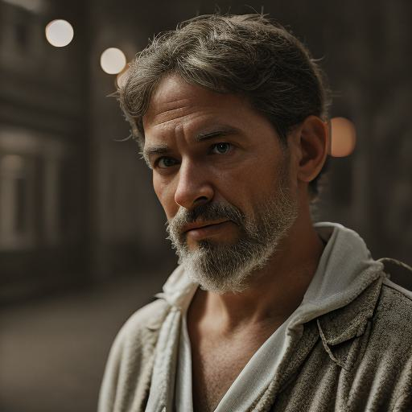

# You Only Sample Once: Taming One-Step Text-To-Image Synthesis by Self-Cooperative Diffusion GANs

This is the Official Repository of  You Only Sample Once: Taming One-Step Text-To-Image Synthesis by Self-Cooperative Diffusion GANs, by *Yihong Luo, Xiaolong Chen, Jing Tang*.


## Pre-trained Models
- [YOSO-PixArt-α-512](https://huggingface.co/Luo-Yihong/yoso_pixart512)
- [YOSO-PixArt-α-1024](https://huggingface.co/Luo-Yihong/yoso_pixart1024)
- [YOSO-sd1.5-lora](https://huggingface.co/Luo-Yihong/yoso_sd1.5_lora)
  
This is an early version of our pre-trained models, it is expected to be updated soon.

Note that YOSO-PixArt-α-512 is trained on JourneyDB with 512 resolution. YOSO-PixArt-α-1024 is obtained by directly merging YOSO-PixArt-α-512 with [PixArt-XL-2-1024-MS](https://huggingface.co/PixArt-alpha/PixArt-XL-2-1024-MS).

## Usage
We take [YOSO-sd1.5-lora](https://huggingface.co/Luo-Yihong/yoso_sd1.5_lora) as an example.
It is highly recommended to utilize [YOSO-sd1.5-lora](https://huggingface.co/Luo-Yihong/yoso_sd1.5_lora) in conjunction with realistic-vision-v51 to produce impressive samples by 2 steps.
```python
pipeline = DiffusionPipeline.from_pretrained("stablediffusionapi/realistic-vision-v51", torch_dtype = torch.float16)
pipeline = pipeline.to('cuda')
pipeline.scheduler = LCMScheduler.from_config(pipeline.scheduler.config)
pipeline.load_lora_weights('Luo-Yihong/yoso_sd1.5_lora')
generator = torch.manual_seed(318)
steps = 2
imgs= pipeline(prompt="A photo of a man, XT3",
                    num_inference_steps=steps, 
                    num_images_per_prompt = 1,
                        generator = generator,
                        guidance_scale=1.5,
                   )[0]
imgs
```


## Contact
Please contact Yihong Luo (yluocg@connect.ust.hk) if you have any questions about this paper.

